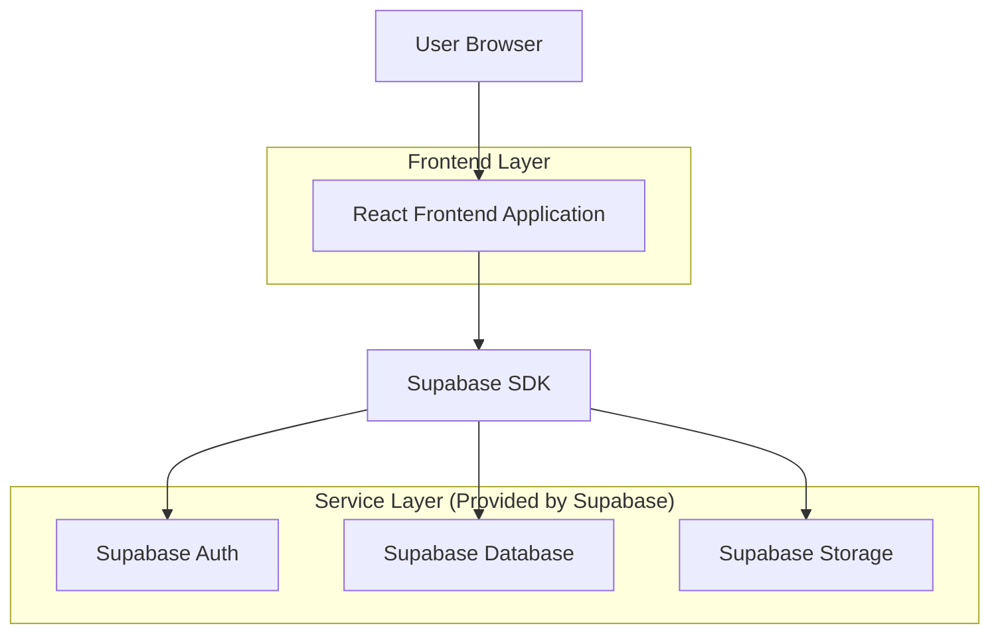
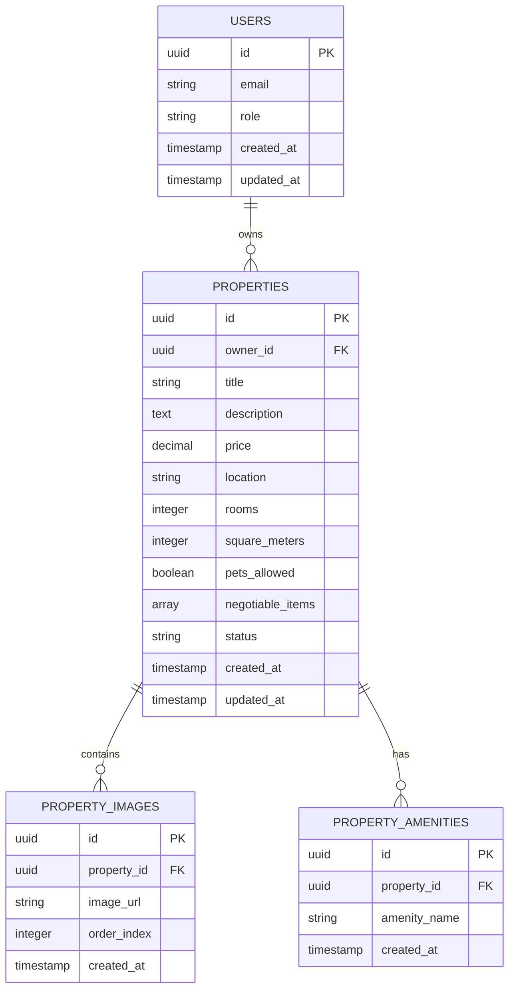

## 1. Architecture design



## 2. Technology Description
- Frontend: React@18 + tailwindcss@3 + vite
- Initialization Tool: vite-init
- Backend: Supabase (Authentication, Database, Storage)
- UI Components: HeadlessUI for accessible components
- Image Handling: React Dropzone for file uploads

## 3. Route definitions
| Route | Purpose |
|-------|---------|
| / | Property listings page with search and filters |
| /property/:id | Individual property details page |
| /owner/upload | Property upload form for owners |
| /owner/login | Owner authentication page |
| /owner/dashboard | Owner's property management dashboard |

## 4. API definitions

### 4.1 Property Management APIs

```
GET /api/properties
```

Request (via Supabase):
| Param Name| Param Type  | isRequired  | Description |
|-----------|-------------|-------------|-------------|
| price_min | number | false | Minimum price filter |
| price_max | number | false | Maximum price filter |
| rooms | number | false | Number of rooms |
| square_meters_min | number | false | Minimum square meters |
| square_meters_max | number | false | Maximum square meters |
| pets_allowed | boolean | false | Pet policy filter |
| amenities | array | false | Array of amenity strings |

### 4.2 Property Upload API

```
POST /api/properties
```

Request (authenticated):
| Param Name| Param Type  | isRequired  | Description |
|-----------|-------------|-------------|-------------|
| title | string | true | Property title |
| description | string | true | Property description |
| price | number | true | Monthly rent price |
| location | string | true | Property address |
| rooms | number | true | Number of rooms |
| square_meters | number | true | Property size |
| images | array | true | Array of image URLs from storage |
| amenities | array | false | Array of amenity strings |
| pets_allowed | boolean | true | Pet policy |
| negotiable_items | array | false | Array of negotiable aspects |

## 5. Data model

### 5.1 Data model definition


### 5.2 Data Definition Language

Users Table (users)
```sql
-- create table
CREATE TABLE users (
    id UUID PRIMARY KEY DEFAULT gen_random_uuid(),
    email VARCHAR(255) UNIQUE NOT NULL,
    role VARCHAR(20) DEFAULT 'seeker' CHECK (role IN ('seeker', 'owner')),
    created_at TIMESTAMP WITH TIME ZONE DEFAULT NOW(),
    updated_at TIMESTAMP WITH TIME ZONE DEFAULT NOW()
);

-- grant permissions
GRANT SELECT ON users TO anon;
GRANT ALL PRIVILEGES ON users TO authenticated;
```

Properties Table (properties)
```sql
-- create table
CREATE TABLE properties (
    id UUID PRIMARY KEY DEFAULT gen_random_uuid(),
    owner_id UUID REFERENCES users(id) ON DELETE CASCADE,
    title VARCHAR(255) NOT NULL,
    description TEXT NOT NULL,
    price DECIMAL(10,2) NOT NULL,
    location VARCHAR(255) NOT NULL,
    rooms INTEGER NOT NULL CHECK (rooms > 0),
    square_meters INTEGER NOT NULL CHECK (square_meters > 0),
    pets_allowed BOOLEAN DEFAULT FALSE,
    negotiable_items TEXT[],
    status VARCHAR(20) DEFAULT 'active' CHECK (status IN ('active', 'inactive', 'rented')),
    created_at TIMESTAMP WITH TIME ZONE DEFAULT NOW(),
    updated_at TIMESTAMP WITH TIME ZONE DEFAULT NOW()
);

-- create indexes
CREATE INDEX idx_properties_price ON properties(price);
CREATE INDEX idx_properties_location ON properties(location);
CREATE INDEX idx_properties_rooms ON properties(rooms);
CREATE INDEX idx_properties_status ON properties(status);

-- grant permissions
GRANT SELECT ON properties TO anon;
GRANT ALL PRIVILEGES ON properties TO authenticated;
```

Property Images Table (property_images)
```sql
-- create table
CREATE TABLE property_images (
    id UUID PRIMARY KEY DEFAULT gen_random_uuid(),
    property_id UUID REFERENCES properties(id) ON DELETE CASCADE,
    image_url TEXT NOT NULL,
    order_index INTEGER DEFAULT 0,
    created_at TIMESTAMP WITH TIME ZONE DEFAULT NOW()
);

-- create indexes
CREATE INDEX idx_property_images_property_id ON property_images(property_id);

-- grant permissions
GRANT SELECT ON property_images TO anon;
GRANT ALL PRIVILEGES ON property_images TO authenticated;
```

Property Amenities Table (property_amenities)
```sql
-- create table
CREATE TABLE property_amenities (
    id UUID PRIMARY KEY DEFAULT gen_random_uuid(),
    property_id UUID REFERENCES properties(id) ON DELETE CASCADE,
    amenity_name VARCHAR(50) NOT NULL,
    created_at TIMESTAMP WITH TIME ZONE DEFAULT NOW()
);

-- create indexes
CREATE INDEX idx_property_amenities_property_id ON property_amenities(property_id);

-- grant permissions
GRANT SELECT ON property_amenities TO anon;
GRANT ALL PRIVILEGES ON property_amenities TO authenticated;
```

### 5.3 Row Level Security (RLS) Policies

Properties RLS Policies:
```sql
-- Enable RLS
ALTER TABLE properties ENABLE ROW LEVEL SECURITY;

-- Allow all users to view active properties
CREATE POLICY "Anyone can view active properties" ON properties
    FOR SELECT USING (status = 'active');

-- Allow owners to manage their own properties
CREATE POLICY "Owners can manage their properties" ON properties
    FOR ALL USING (auth.uid() = owner_id);
```