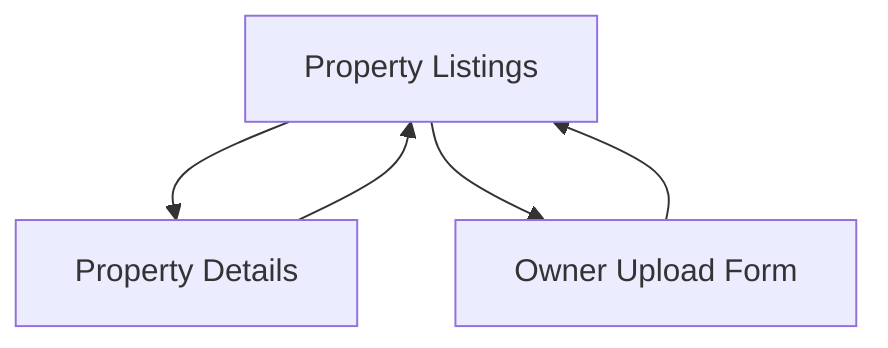

## 1. Product Overview
RentinDR is a modern property rental platform that simplifies the rental process, making it as easy as shopping on Amazon. The MVP focuses on connecting property owners with potential renters through an intuitive listing and filtering system.

The platform solves the problem of complex, fragmented rental processes by providing a unified, user-friendly interface for property discovery and owner onboarding.

## 2. Core Features

### 2.1 User Roles
| Role | Registration Method | Core Permissions |
|------|---------------------|------------------|
| Property Seeker | Email registration | Browse listings, apply filters, view property details |
| Property Owner | Email registration + verification | Upload properties, manage listings, edit property information |

### 2.2 Feature Module
Our rental platform MVP consists of the following main pages:
1. **Property Listings**: Display all available properties with search and filter capabilities
2. **Property Details**: Individual property view with images and comprehensive information
3. **Owner Upload Form**: Professional form for property owners to list their properties

### 2.3 Page Details
| Page Name | Module Name | Feature description |
|-----------|-------------|---------------------|
| Property Listings | Search Bar | Allow users to search properties by location or keywords |
| Property Listings | Filter Panel | Filter by price range, number of rooms, square meters, pet allowance, and amenities (gym, pool, etc.) |
| Property Listings | Property Cards | Display property preview with image, price, location, key features |
| Property Listings | Pagination | Navigate through multiple pages of results |
| Property Details | Image Gallery | Display multiple property images in carousel format |
| Property Details | Property Information | Show price, location, size, rooms, amenities, pet policy |
| Property Details | Description | Detailed property description and renting requirements |
| Property Details | Contact Form | Allow interested renters to contact property owner |
| Owner Upload Form | Property Images | Upload multiple property photos with drag-and-drop interface |
| Owner Upload Form | Basic Information | Input price, location, square meters, number of rooms |
| Owner Upload Form | Amenities Selection | Checkbox selection for amenities (gym, pool, parking, etc.) |
| Owner Upload Form | Pet Policy | Select pet allowance options |
| Owner Upload Form | Description & Requirements | Text areas for property description and renting requirements |
| Owner Upload Form | Negotiable Items | Checkboxes for negotiable aspects (price, lease terms, pets, etc.) |
| Owner Upload Form | Preview & Submit | Preview listing before final submission |

## 3. Core Process
### Property Seeker Flow
Users land on the property listings page, apply filters to narrow down options, click on interesting properties to view details, and contact owners through the contact form.

### Property Owner Flow
Owners access the upload form, add property images and details, specify negotiable items, preview their listing, and submit for publication.

## 4. User Interface Design

### 4.1 Design Style
- **Primary Color**: Deep blue (#1E3A8A) for trust and professionalism
- **Secondary Color**: Light gray (#F3F4F6) for clean backgrounds
- **Button Style**: Rounded corners with subtle shadows, primary actions in blue
- **Font**: Inter or similar modern sans-serif, 16px base size
- **Layout**: Card-based design with generous white space
- **Icons**: Minimalist line icons from Feather or similar icon set

### 4.2 Page Design Overview
| Page Name | Module Name | UI Elements |
|-----------|-------------|-------------|
| Property Listings | Filter Panel | Collapsible sidebar with clean input fields, price range slider, checkbox groups for amenities |
| Property Listings | Property Cards | Grid layout (3 columns desktop), hover effects, professional photography emphasis |
| Property Details | Image Gallery | Full-width hero image with thumbnail carousel below, responsive lightbox |
| Owner Upload Form | Image Upload | Drag-and-drop zone with preview thumbnails, progress indicators |
| Owner Upload Form | Form Sections | Clean white cards with subtle borders, clear section headers, inline validation |

### 4.3 Responsiveness
Desktop-first design approach with responsive breakpoints at 1024px (tablet) and 768px (mobile). Touch-optimized interactions for mobile devices with swipeable image galleries and tap-friendly buttons.

### 4.4 Professional Touches
- Smooth animations and transitions (300ms ease-in-out)
- Loading states with skeleton screens
- Success/error notifications with toast messages
- Professional photography placeholders for empty states